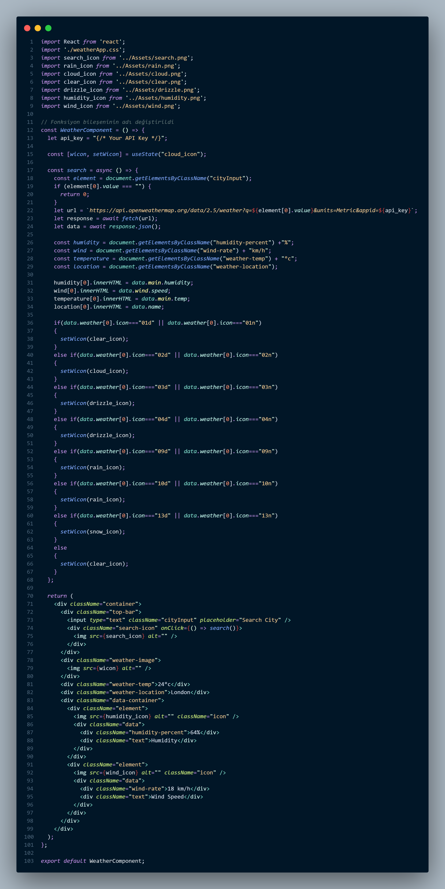

# React Projesi

Bu proje, React kullanarak bir web uygulaması geliştirmek için oluşturulmuştur. Proje içerisinde, React ve Css kullanarak todo list yaptım.

## Nasıl Çalıştırılır

1. Projenin klonunu alın:

    ```
    git clone https://github.com/Yusuf-Osmanoglu/Patika-React-weatherApp
    ```

2. Proje dizinine gidin:

    ```
    cd Patika-React-weatherApp
    ```

3. Gerekli bağımlılıkları yükleyin:

    ```
    npm install
    ```

4. Projeyi başlatın:

    ```
    npm start
    ```

## Kullanılan Teknolojiler

- React
- Fetch
- CSS (stil ve tasarım)

## Ekran Görüntüsü




---

# React Project

This project was created to develop a web application using React. In the project, I made a todo list using React and Css.

## How to Run

1. Clone the project:

    ```
    git clone https://github.com/Yusuf-Osmanoglu/Patika-React-weatherApp
    ```

2. Navigate to the project directory:

    ```
    cd Patika-React-weatherApp
    ```

3. Install the dependencies:

    ```
    npm install
    ```

4. Start the project:

    ```
    npm start
    ```

## Technologies Used

- React
- Fetch
- CSS (for styling and design)

## Screenshot


